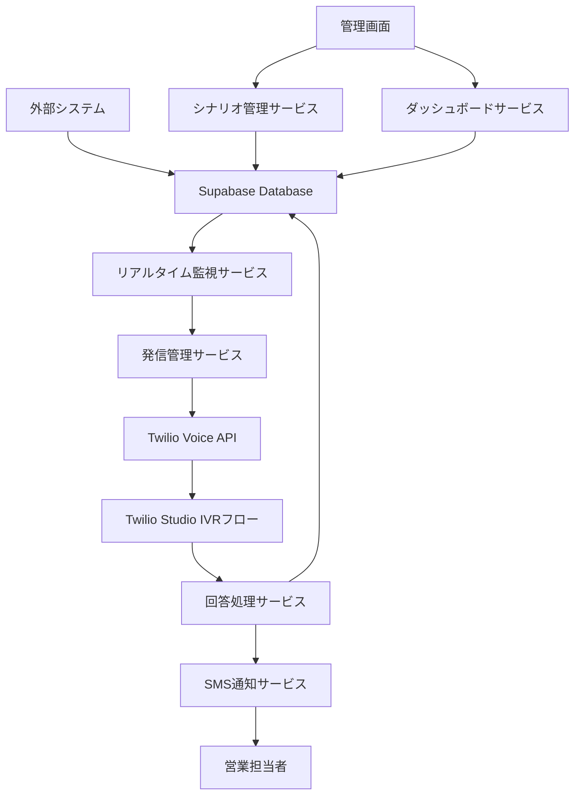

# 設計書

## 概要

自動音声通話システム（IVR）は、Supabaseに格納された電話番号データをリアルタイムで監視し、即座に自動発信を行い、動的に設定可能なシナリオに基づいて情報を収集し、結果をSupabaseに保存してSMS通知を送信するシステムです。

## アーキテクチャ

### システム全体構成



### 技術スタック

- **データベース**: Supabase (PostgreSQL + リアルタイム機能)
- **音声通話**: Twilio Programmable Voice + Twilio Studio
- **SMS通知**: Twilio SMS API
- **バックエンド**: Node.js (Express/Fastify)
- **フロントエンド**: Next.js
- **オートメーション**: n8n (オプション)
- **認証**: Supabase Auth

## コンポーネントと インターフェース

### 1. リアルタイム監視サービス (Real-time Monitor Service)

**責任**: Supabaseの電話番号データ変更をリアルタイムで監視し、発信トリガーを実行

**主要機能**:
- Supabase Realtime Subscriptionによるデータ変更監視
- 新規電話番号データのバリデーション
- 発信キューへの追加
- 接続エラー時の自動再接続

**インターフェース**:
```typescript
interface RealtimeMonitorService {
  startMonitoring(): Promise<void>
  stopMonitoring(): Promise<void>
  onNewPhoneNumber(callback: (phoneData: PhoneNumberData) => void): void
  validatePhoneData(data: PhoneNumberData): ValidationResult
}

interface PhoneNumberData {
  id: string
  phoneNumber: string
  createdAt: Date
  metadata?: Record<string, any>
}
```

### 2. 発信管理サービス (Call Management Service)

**責任**: 発信キューの管理、Twilio APIとの連携、同時発信数制御

**主要機能**:
- 発信キューの管理（FIFO）
- 同時発信数の制御
- Twilio Voice APIを使用した発信実行
- 発信ステータスの管理
- 再試行ロジック

**インターフェース**:
```typescript
interface CallManagementService {
  addToQueue(phoneData: PhoneNumberData): Promise<void>
  processQueue(): Promise<void>
  initiateCall(phoneNumber: string, scenarioId: string): Promise<CallResult>
  updateCallStatus(callId: string, status: CallStatus): Promise<void>
  getQueueStatus(): QueueStatus
}

interface CallResult {
  callId: string
  status: 'initiated' | 'failed'
  twilioCallSid?: string
  error?: string
}
```

### 3. シナリオ管理サービス (Scenario Management Service)

**責任**: IVRシナリオの作成、編集、バリデーション、Twilio Studioフローとの同期

**主要機能**:
- シナリオのCRUD操作
- 質問項目と分岐条件の管理
- Twilio Studioフローの自動生成・更新
- シナリオのバリデーション

**インターフェース**:
```typescript
interface ScenarioManagementService {
  createScenario(scenario: IVRScenario): Promise<string>
  updateScenario(id: string, scenario: IVRScenario): Promise<void>
  deleteScenario(id: string): Promise<void>
  getScenario(id: string): Promise<IVRScenario>
  validateScenario(scenario: IVRScenario): ValidationResult
  syncToTwilioStudio(scenarioId: string): Promise<string>
}

interface IVRScenario {
  id: string
  name: string
  description: string
  questions: Question[]
  transitions: Transition[]
}

interface Question {
  id: string
  text: string
  type: 'dtmf' | 'voice_recording'
  options?: Option[]
  required: boolean
  maxLength?: number
}
```

### 4. 回答処理サービス (Response Processing Service)

**責任**: Twilio Studioからの回答データ受信、Supabaseへの保存、SMS通知トリガー

**主要機能**:
- Twilio Webhookの受信・処理
- 回答データの構造化・バリデーション
- Supabaseへの項目別保存
- 音声ファイルのSupabase Storageへの保存
- SMS通知サービスへの通知

**インターフェース**:
```typescript
interface ResponseProcessingService {
  processWebhook(webhookData: TwilioWebhookData): Promise<void>
  saveResponse(callId: string, responses: ResponseData[]): Promise<void>
  saveAudioFile(callId: string, audioUrl: string, questionId: string): Promise<string>
  triggerSMSNotification(callId: string, responses: ResponseData[]): Promise<void>
}

interface ResponseData {
  questionId: string
  questionText: string
  answerType: 'dtmf' | 'voice'
  answerValue: string
  answerLabel?: string
  audioFileUrl?: string
}
```

### 5. SMS通知サービス (SMS Notification Service)

**責任**: 営業担当者へのSMS通知送信、通知テンプレート管理

**主要機能**:
- Twilio SMS APIを使用した通知送信
- 通知テンプレートの管理
- 優先度に基づく通知内容の調整
- 送信失敗時の再送処理

**インターフェース**:
```typescript
interface SMSNotificationService {
  sendCallCompletionNotification(
    salesPersonPhone: string, 
    callData: CallCompletionData
  ): Promise<void>
  sendFollowUpReminder(
    salesPersonPhone: string, 
    reminderData: ReminderData
  ): Promise<void>
  retryFailedNotifications(): Promise<void>
}

interface CallCompletionData {
  phoneNumber: string
  responses: ResponseData[]
  completedAt: Date
  priority: 'normal' | 'high'
  assignedPlan?: string
}
```

### 6. 管理画面サービス (Admin Dashboard Service)

**責任**: Web管理画面のAPI提供、認証・認可

**主要機能**:
- ダッシュボードデータの集計・提供
- シナリオ管理API
- 発信状況・回答データの表示API
- 手動発信API
- 認証・認可

**インターフェース**:
```typescript
interface AdminDashboardService {
  getDashboardStats(): Promise<DashboardStats>
  getCallHistory(filters: CallHistoryFilters): Promise<CallHistory[]>
  getResponseData(filters: ResponseFilters): Promise<ResponseSummary[]>
  triggerManualCall(phoneNumber: string, scenarioId: string): Promise<void>
  getSupabaseSyncStatus(): Promise<SyncStatus>
}
```

## データモデル

### Supabaseテーブル設計

#### 1. phone_numbers テーブル
```sql
CREATE TABLE phone_numbers (
  id UUID PRIMARY KEY DEFAULT gen_random_uuid(),
  phone_number VARCHAR(20) NOT NULL UNIQUE,
  status VARCHAR(20) DEFAULT 'pending',
  created_at TIMESTAMP WITH TIME ZONE DEFAULT NOW(),
  updated_at TIMESTAMP WITH TIME ZONE DEFAULT NOW(),
  metadata JSONB,
  assigned_sales_person VARCHAR(20)
);
```

#### 2. ivr_scenarios テーブル
```sql
CREATE TABLE ivr_scenarios (
  id UUID PRIMARY KEY DEFAULT gen_random_uuid(),
  name VARCHAR(100) NOT NULL,
  description TEXT,
  scenario_data JSONB NOT NULL,
  twilio_flow_sid VARCHAR(50),
  is_active BOOLEAN DEFAULT true,
  created_at TIMESTAMP WITH TIME ZONE DEFAULT NOW(),
  updated_at TIMESTAMP WITH TIME ZONE DEFAULT NOW()
);
```

#### 3. call_logs テーブル
```sql
CREATE TABLE call_logs (
  id UUID PRIMARY KEY DEFAULT gen_random_uuid(),
  phone_number_id UUID REFERENCES phone_numbers(id),
  twilio_call_sid VARCHAR(50),
  scenario_id UUID REFERENCES ivr_scenarios(id),
  status VARCHAR(20) DEFAULT 'initiated',
  started_at TIMESTAMP WITH TIME ZONE DEFAULT NOW(),
  completed_at TIMESTAMP WITH TIME ZONE,
  duration INTEGER,
  error_message TEXT
);
```

#### 4. call_responses テーブル
```sql
CREATE TABLE call_responses (
  id UUID PRIMARY KEY DEFAULT gen_random_uuid(),
  call_log_id UUID REFERENCES call_logs(id),
  question_id VARCHAR(50) NOT NULL,
  question_text TEXT NOT NULL,
  answer_type VARCHAR(20) NOT NULL,
  answer_value TEXT,
  answer_label TEXT,
  audio_file_url TEXT,
  created_at TIMESTAMP WITH TIME ZONE DEFAULT NOW()
);
```

#### 5. sms_notifications テーブル
```sql
CREATE TABLE sms_notifications (
  id UUID PRIMARY KEY DEFAULT gen_random_uuid(),
  call_log_id UUID REFERENCES call_logs(id),
  recipient_phone VARCHAR(20) NOT NULL,
  message_content TEXT NOT NULL,
  twilio_message_sid VARCHAR(50),
  status VARCHAR(20) DEFAULT 'pending',
  sent_at TIMESTAMP WITH TIME ZONE,
  retry_count INTEGER DEFAULT 0,
  created_at TIMESTAMP WITH TIME ZONE DEFAULT NOW()
);
```

## エラーハンドリング

### エラー分類と対応

1. **Supabase接続エラー**
   - 自動再接続（指数バックオフ）
   - フェイルオーバー機能
   - エラーログ記録

2. **Twilio API エラー**
   - レート制限対応
   - 再試行ロジック（最大3回）
   - エラー通知

3. **データバリデーションエラー**
   - 詳細エラーメッセージ
   - 管理画面での確認機能
   - 自動修正機能（可能な場合）

4. **SMS送信エラー**
   - 再送キュー
   - 代替通知手段（メール等）
   - エラー統計

### エラー監視とアラート

```typescript
interface ErrorHandlingService {
  logError(error: SystemError): Promise<void>
  sendAlert(severity: 'low' | 'medium' | 'high', message: string): Promise<void>
  getErrorStats(timeRange: TimeRange): Promise<ErrorStats>
}
```

## テスト戦略

### 1. 単体テスト
- 各サービスクラスのメソッド
- データバリデーション
- エラーハンドリング

### 2. 統合テスト
- Supabase連携
- Twilio API連携
- サービス間連携

### 3. E2Eテスト
- 電話番号登録から通知完了までの全フロー
- 管理画面操作
- エラーシナリオ

### 4. 負荷テスト
- 同時発信数制限
- 大量データ処理
- リアルタイム監視性能

### テスト環境

- **開発環境**: ローカル + Supabase開発プロジェクト
- **ステージング環境**: Twilio開発アカウント + テスト用電話番号
- **本番環境**: 段階的ロールアウト